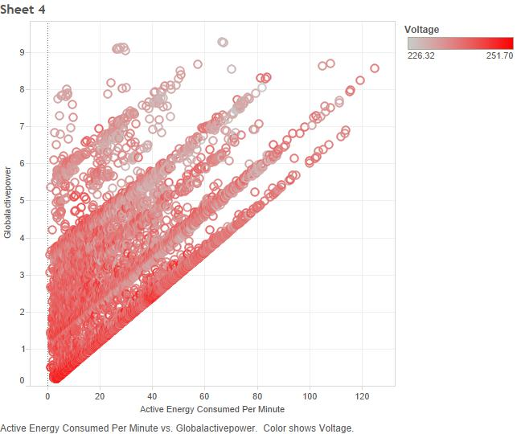
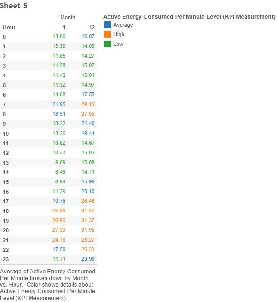
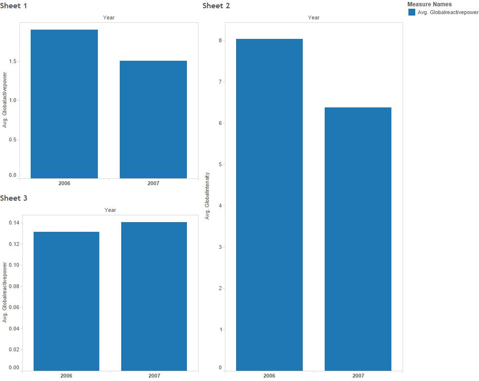

##DV Project 3

1) We found a data set (csv file) about Diabetes patients with thousands of rows of data as well as a few other associated data sets (csv files) . We then regiestered our data set type under the PROJECt_4DATA column using the "Register Your Project" link on the class website.

2) We loaded each CSV file into one of our Oracle accounts using a modified version of R_ETL.R.


```{r}
source("../01 Data/Data.R", echo = TRUE)
```
```{r}
source("../01 Data/Data_Weather.R", echo = TRUE)
```


3) We uploaded the oracle database into tableau so we could manipulate the data

4) Using the data we uploaded to tableau we created a scatter plot, a cross tab with KPI and parameters, and bar charts

  

This plot shows that as the average active energy consumed per minute increases so does the global active energy used.  This is to be expected, but it would also be expected that voltage would increase; however, voltage does not seem to be correlated with the increase in average active energy consumed per minute.

  

This crosstab shows the average active energy consumed per minute based on the hour for December 2006 and January 2007.  We were expecting higher usage in the morning and the evening, but this chart shows only more usage in the evening.

  

This chart compares the global active power, global intensity (current), and global reactive power.  We were expecting similar values for both 2006 and 2007.  However, the chart shows a little more usage in 2006.
